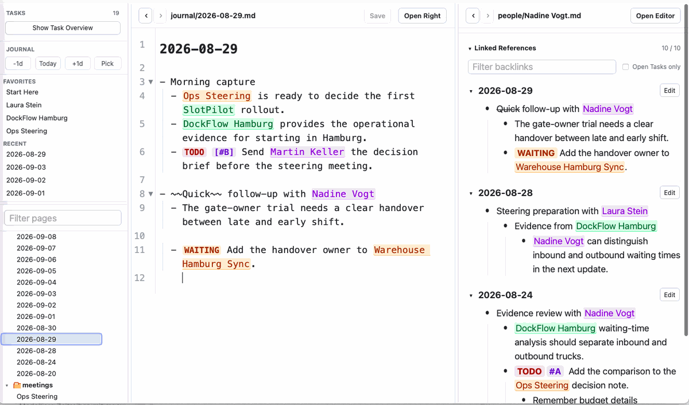

# Logtext

<p align="center">
  
</p>

Built for local, personal knowledge management with project and task management in
mind. Capture meeting notes, decisions, project thoughts, risks, follow-ups, and open
questions without deciding up front where every fragment belongs.

> Capture first. Structure later. Files forever.
> 
## Goals
- frictionless daily capture in local Markdown files
- context through wiki links, semantic tags, and backlinks
- a simple task and to-do workflow
- direct paste for screenshots and other images
- rendered LaTeX formulas and Mermaid diagrams
- no proprietary storage format for primary content

Logtext is inspired by Org mode and Logseq. Ordinary Markdown files remain the
source of truth.




## Workflow

Start in today's journal and write in blocks:

```md
- Meeting with [[people/Katja]]
  - [[projects/Rollout]] may be delayed
  - TODO agree new rollout date
```

People, projects, and other entities can be referenced before their pages
exist. Opening `[[projects/Rollout]]` later shows linked references from
journals, project notes, and other pages, including their surrounding blocks.

```text
Capture -> Connect -> Structure -> Retrieve
```

instead of:

```text
Create database -> define schema -> create document -> fill fields
```

## Main Features

- local workspaces made of ordinary folders and Markdown files
- `[[wiki links]]` and `#tags` to reference people, projects, or any other entity
- daily journal pages stored as `YYYY-MM-DD.md`
- backlinks with parent and child block context
- configurable task states, colors, and priorities
- filtered and grouped task overview
- images/screenshots and media cleanup
- LaTeX rendering in Markdown views and editor live preview
- Mermaid diagrams


## Installation

Download the current release from
[GitHub Releases](https://github.com/elliptical-cow/logtext/releases/latest).

| Platform | Asset | Notes |
| --- | --- | --- |
| Windows | `Logtext-v<version>-windows-x86_64-setup.exe` | NSIS installer |
| Windows | `Logtext-v<version>-windows-x86_64-portable.exe` | portable executable |
| macOS | `Logtext-v<version>-macos-universal-app.zip` | universal Intel and Apple Silicon app |
| Debian/Ubuntu | `Logtext-v<version>-linux-x86_64.deb` | installs through the package manager |
| Linux | `Logtext-v<version>-linux-x86_64.AppImage` | portable fallback |
| Linux | `Logtext-v<version>-linux-x86_64-thin.tar.gz` | small archive; requires compatible GTK 3 and WebKitGTK 4.1 system libraries |

Basic installation:

- **Windows:** run the setup executable, or start the portable executable
  directly.
- **macOS:** extract the archive and move `Logtext.app` to `Applications`.
- **Debian/Ubuntu:** install the downloaded package with
  `sudo apt install ./Logtext-v<version>-linux-x86_64.deb`.
- **AppImage:** make it executable with `chmod +x` and run it.
- **Thin Linux archive:** extract it and read the included `README.txt` before
  running `Logtext`.

Logtext is in early development. Keep backups of important workspaces,
especially when testing file operations.

See the [manual](docs/manual.md#installation) for more detail.

## Quick Start

1. Start Logtext.
2. Open a folder with `File > Open Workspace Folder...`.
3. Logtext opens or creates today's page in `journal/`.
4. Capture notes in blocks and connect people, projects, or topics with
   `[[page]]` or `#page`.
5. Add tasks with states such as `TODO`, `INPROGRESS`, `WAITING`, and `DONE`.
6. Open a linked page to review its backlinks and surrounding context.
7. Use Task Overview to filter, group, and revisit open work across the
   workspace.

A ready-to-open workspace is included in
[`docs/example_workspace`](docs/example_workspace). Open the folder in Logtext
and begin with [Start Here](docs/example_workspace/Start%20Here.md).

## Markdown Syntax

```md
# Page title

- Link to [[projects/Project Alpha]]
- Compact link to #people/Katja
- TODO [#A] Prepare project review
- [ ] Plain checkbox

Inline formula: $E = mc^2$


```

Wiki links, task states, and configuration are described in the
[manual](docs/manual.md).

## Import A Logseq Markdown Graph

Logtext includes an initial command-line importer for classic, file-based
Logseq Markdown graphs. Release downloads provide standalone binaries for Linux
x86_64, Windows x86_64, and universal macOS. The importer always creates a new
Logtext workspace and never modifies the source graph. Run a dry run from the
source tree before writing the destination:

```bash
cargo run --manifest-path src-tauri/Cargo.toml --bin logtext-import-logseq -- \
  --dry-run /path/to/logseq-graph /path/to/new-logtext-workspace
```

Remove `--dry-run` to create the workspace. See the
[Logseq import guide](docs/logseq-import.md) for supported conversions, safety
behavior, and known limitations.

## Build From Source

Requirements:

- Node.js 22 and npm
- stable Rust toolchain
- [Tauri 2 platform prerequisites](https://v2.tauri.app/start/prerequisites/)

```bash
npm ci
npm run tauri dev
```

Run the frontend without the desktop shell:

```bash
npm run dev
```

Build a local desktop release:

```bash
npm run tauri build
```

See [CONTRIBUTING.md](CONTRIBUTING.md) for checks, branch conventions, and the
release workflow.

## Documentation

- [User manual](docs/manual.md)
- [Logseq import guide](docs/logseq-import.md)
- [Example workspace](docs/example_workspace)
- [Change log](CHANGELOG.md)
- [Contributing](CONTRIBUTING.md)
- [Developer notes](docs/dev-notes.md)
- [Performance baselines](docs/performance-baselines.md)
- [Security policy](SECURITY.md)

## License

Logtext is licensed under the GNU Affero General Public License v3.0. See
[LICENSE](LICENSE).
