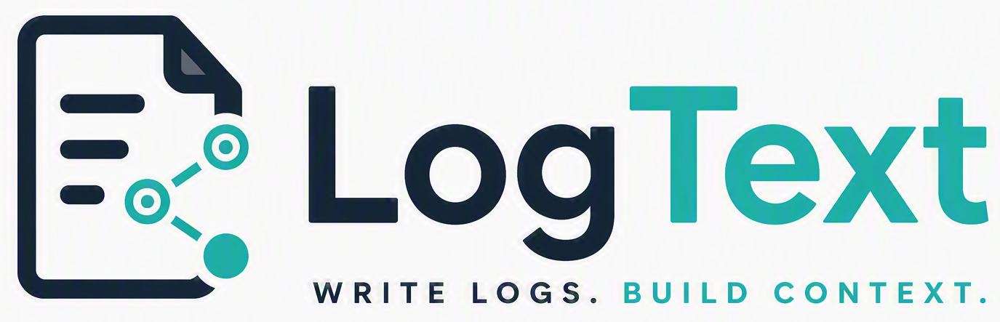

# Logtext

<p align="center">
  
</p>

Goal
- Allow for frictionless capturing of daily logs in local Markdown files.
- Context should emerge by grouped tags and backlinks.
- Simple task/todo-list workflow.
- Copy&paste for images, like screenshots.
- Support for LaTex formulas and Mermaid diagramms

The app is inspired by OrgMode and Logseq, but Markdown files remain the source
of truth.

## Example Workspace

A ready-to-open example workspace is included in
[`docs/example_workspace`](docs/example_workspace). Open this folder in Logtext
and start with [Start Here](docs/example_workspace/Start%20Here.md) to explore
journals, backlinks, tasks, favorites, folder colors, and the three-pane
workflow.

## Product Vision

Logtext is built for personal knowledge management with project and task management in mind. It follows a simple approach:

> Capture first. Structure later. Files forever.

The app is meant to be a place to quickly write down 
meeting notes, decisions, project thoughts, risks, follow-ups, and open questions without deciding
up front where each fragment belongs.

## The default workflow is

Start in today's journal and write in blocks.

```md
- Meeting with [[people/Katja]]
  - [[projects/Rollout]] may be delayed
  - TODO agree new rollout date
```

Entities (like people or projects) can be referenced as links, if the user wants to gather information related to this entity later.

It is not necessary to create a project page first. The link is enough.
Opening `[[projects/Rollout]]` later shows the linked references from journals,
project notes, and other pages with parent and child context.

This keeps capture cheap:

```text
Capture -> Connect -> Structure -> Retrieve
```

instead of:

```text
Create database -> define schema -> create document -> fill fields
```


## Main Concepts

### Workspace

Open a workspace with `File > Open Workspace Folder...`. Logtext scans all
Markdown files below that folder recursively.

On startup Logtext reads `~/.logtext` from the user home directory. If that file
contains a `lastWorkspace` entry, the workspace is opened automatically. When a
workspace is opened, the path is stored there again for the next start.

After the workspace is loaded, the middle pane always opens today's journal at
`<journalFolder>/YYYY-MM-DD.md` (`journal/YYYY-MM-DD.md` by default). If the
file does not exist, Logtext creates it. The right pane keeps its previous
context page from the last session.

The right pane presents dated journal pages as one continuous feed and presents 
rendered version of the Markdown files.

Each workspace can also contain a `.config` file. Logtext creates it if needed
and stores workspace-specific settings there, for example task colors, expanded
folders.

### Three-Pane Layout

Logtext uses three resizable panes:

- left pane: workspace navigation, favorites, recent pages, task overview entry
  and global search
- middle pane: current editor page or task overview
- right pane: an independent rendered context page

The middle and right pane can show different files. This is useful when editing
one note while keeping another page, a project overview, or a backlink target
open for context.

### Pages and Wiki Links

New pages are created with a first-level Markdown heading based on the file
name:

```md
# Project Alpha
```

Logtext uses the first `# Heading` as the page title in navigation, task
overview, backlinks, and search results. Existing files without a first-level
heading fall back to the file name without `.md` until opened; when such a file
is opened, Logtext adds the default first-level heading at the top.

Internal links use wiki-link or hashtag syntax:

```md
[[Project Alpha]]
[[projects/Project Alpha]]
[[projects/Project Alpha|Alpha]]
#Project-Alpha
#projects/Project-Alpha
```

Link targets are resolved case-insensitively. The actual spelling of file and
folder names is not changed. `.md` in a link target is tolerated, but normal
links should be written without it.

The compact `#link` form is an alternative for targets that contain no spaces.
It supports letters, numbers, `_`, `-`, internal dots, and `/` between path
segments. For example, `#projects/Forecast-2027` points to
`projects/Forecast-2027.md`. Use `[[Project Alpha]]` for targets with spaces or
when an alias such as `[[projects/Project Alpha|Alpha]]` is needed. Markdown
headings (`# Heading`), task priorities (`[#A]`), URL fragments, escaped hash
characters, and hash text in code are not interpreted as compact links.

After typing `[[` or a compact `#` target in the editor, Logtext offers matching
page suggestions based on the current input. Selecting a `[[` suggestion inserts
the target and closes the link with `]]`. The `#` suggestions include all pages:
space-free targets remain compact links, while selecting a target containing
spaces automatically replaces the compact input with a `[[target]]` link.
Suggestions show the full relative page path so the inserted target is
unambiguous.

Rendered wiki links without an alias use a compact display label. If the page
name is unique, only the page name is shown; if multiple pages share that name,
Logtext shows enough path context to distinguish them.

Missing target pages are marked in rendered views and can be created explicitly.

### Images

Paste a screenshot or raster image from the clipboard directly into an open
page. Logtext stores PNG, JPEG, WebP, and GIF images of up to 20 MiB in the
configured workspace media folder and inserts a Markdown reference rooted at
the workspace at the current editor selection:

```md

```

The filename contains a normalized form of the source page path, a timestamp,
and a short content fingerprint. Images are rendered in the editor's live
preview and in all rendered Markdown views, including the right pane, journal
feed, linked references, and Task Overview. Every local Markdown image target is
resolved relative to the workspace root, so the same target remains valid when
copied to another page. Leading `/`, operating-system absolute paths, and `..`
segments are not supported.

Hover over an image in the editor live preview to reveal `−` and `+` controls.
They change the displayed width in 20–25 percent steps and persist it in the
optional Markdown image title, while preserving an existing title. Image height
always follows the original aspect ratio. Images wider than the available pane
remain limited to the pane width.

Right-click a workspace image in the editor live preview or a rendered view and
choose `Copy image` to place the image itself on the system clipboard. This
action is available for workspace images only; Logtext does not request
clipboard read access.

The media folder is application-managed and omitted from page navigation and
Markdown indexing. Workspace-relative image targets remain stable when their
page moves. Logtext does not delete image files automatically when a reference
is removed.

### Backlinks

When a block contains a link to another page, that block becomes a linked
reference on the target page. Backlinks are calculated dynamically and are not
written into Markdown files.

Backlinks show:

- source path and page name
- surrounding heading context, such as `Chapter / Section / Subsection`
- the linking block with relevant parent and child blocks

The backlink section can be shown in the right pane and at the end of the middle
pane. In the middle pane it is expanded by default. `Open Tasks only` filters
linked references to backlinks where the block or one of its child blocks
contains an open task.

Backlinks are sorted by source path in reverse alphabetical order, then by their
order inside the source file. This keeps newer journal pages near the top when
they use date-based names.


### Tasks

Tasks are plain Markdown list items with a task keyword:

```md
- TODO Prepare project review
- INPROGRESS [#A] Write decision note
- WAITING[#B] Feedback from stakeholder
- DONE Close release checklist
```

Default task states are:

- `TODO`
- `INPROGRESS`
- `WAITING`
- `DONE`

Task states are configurable in the workspace `.config`. Task state colors are
also configurable and currently support `red`, `yellow`, `green`, `blue`,
`grey`, `orange`, and `pink`.

Priorities use org-mode style priority cookies:

```md
- TODO [#A] High priority task
- TODO[#B] Compact priority syntax
```

Supported priorities are currently `[#A]`, `[#B]`, and `[#C]`.

Right-click a rendered task keyword or priority in the editor, right pane,
backlinks, or task overview to change status or priority through the context
menu.

When a task is set to `DONE`, Logtext can play a short completion sound. This is
controlled by `taskDoneSoundEnabled` in `.config`.

### Checkboxes

Markdown checkboxes are rendered and clickable in the middle and right pane:

```md
- [ ] Open item
- [x] Completed item
```

Clicking a checkbox updates the underlying Markdown file.

### LaTeX formulas

Rendered Markdown views support LaTeX formulas through KaTeX. Use single dollar
signs for inline formulas and double dollar signs for block formulas:

```md
Energy is $E = mc^2$.

$$
\int_0^1 x^2 \, dx
$$
```

The Markdown source remains unchanged. Invalid formulas are shown as source text
without interrupting the rest of the rendered page. The editor's live-preview
mode renders formulas on inactive lines. Selecting an inline formula restores
its source line; selecting any line of a block formula restores the complete
`$$...$$` block for editing.

### Task Overview

Open the task overview from the left pane with `Show Task Overview`, or toggle
it from the native menu with `View > Toggle Task Overview`.

The task overview can filter and group tasks by status, priority, source, text,
and linked pages. Link-based grouping also considers links in parent blocks, so
tasks inherit semantic context from their surrounding outline.

Clicking a task opens its source page in the right pane. The `Edit` action opens
the task in the middle editor and jumps to the task line.

Task overview filter settings are stored in the workspace `.config`.

### Navigation and File Operations

The left pane shows a compact folder tree. Files are sorted descending by
default. Per-folder sorting can be configured in `.config`; the `journal` folder
is descending by default so newer daily notes appear first.

Useful navigation and file actions:

- click a file to open it in the middle editor
- use `R` next to a file to open it in the right pane
- use the star next to a file to mark it as favorite
- right-click files or folders for context actions
- rename pages and folders from the context menu
- move pages by drag and drop or from the context menu
- assign colors to folders from the folder context menu
- open yesterday, today, or tomorrow from the journal shortcuts

When pages or folders are renamed or moved, Logtext updates matching wiki links
to the affected pages. Workspace-relative local image targets remain unchanged.

Folder colors are stored in `.config`. They color the folder icon and wiki-link
chips that point to pages in that folder. The default wiki-link style remains a
light blue background with dark blue text.

### Search

Use `Cmd/Ctrl+F` in the editor to search inside the current file. The search box
can be expanded to show a replace field. Replacements are normal editor changes,
so dirty state, save, and editor undo apply.

The left pane also provides workspace search across indexed Markdown files.
Search results show file, line, and context and can be opened in the editor.

### Keyboard Shortcuts

Use `Help > Keyboard Shortcuts` to show this list inside the app.

Important editor shortcuts:

- `Enter`: create a new block/list item
- `Tab`: indent current or selected block
- `Shift+Tab`: outdent current or selected block
- `Cmd/Ctrl+ArrowUp`: move current block including child blocks up
- `Cmd/Ctrl+ArrowDown`: move current block including child blocks down
- `Cmd/Ctrl+Enter`: add or cycle task state
- `Cmd/Ctrl+Shift+E`: expand all folded blocks
- `Cmd/Ctrl+Shift+T`: toggle task overview
- `Cmd/Ctrl+Shift+L`: toggle live preview/plain Markdown editing
- `Cmd/Ctrl+1` to `Cmd/Ctrl+4`: collapse all blocks below that level
- `Cmd/Ctrl+F`: search in current file
- `Shift+F10` or `Menu`: open the editor context menu at the cursor
- `Cmd/Ctrl+S`: save current file
- `Cmd/Ctrl+Z`: undo
- `Cmd/Ctrl+Shift+Z` or `Cmd/Ctrl+Y`: redo
- `Cmd/Ctrl + mouse wheel`: change UI zoom

Editor text changes use CodeMirror undo. Task changes and checkbox changes made
outside direct text editing are tracked by Logtext's app-level undo stack. The
Edit menu shows the next undo or redo action when available.

The editor context menu combines standard editing commands with actions for the
clicked selection, wiki link, task, or list block. A normal left click remains
the primary way to open an existing wiki link in the editor; its context menu
adds only distinct actions such as opening it in the right pane or copying its
Markdown. Task status and priority choices retain their direct update behavior.

## Configuration

Workspace settings live in `.config` inside the workspace folder. The file is
intended to remain small and human-readable.

Example:

```json
{
  "journalFolder": "journal",
  "mediaFolder": "media",
  "journalEditorContinuousScrolling": true,
  "journalRightPaneContinuousScrolling": true,
  "taskStates": ["TODO", "INPROGRESS", "WAITING", "DONE"],
  "taskStateColors": {
    "TODO": "red",
    "INPROGRESS": "blue",
    "WAITING": "orange",
    "DONE": "green"
  },
  "taskDoneSoundEnabled": true,
  "defaultPageSort": "name-desc",
  "folderPageSort": {
    "journal": "name-desc"
  },
  "folderColors": {
    "projects": "blue"
  },
  "themeMode": "light"
}
```

`journalFolder` is a workspace-relative folder path. It defaults to `journal`.
Journal navigation considers only valid calendar-date files named
`YYYY-MM-DD.md` directly inside this folder. Logtext does not allow subfolders
to be created or moved into the journal folder.

`mediaFolder` is a workspace-relative folder path and defaults to `media`.
It must not overlap the configured journal folder. Logtext creates it on the
first image paste, excludes it from page navigation and indexing, and reserves
it for stored media rather than Markdown pages. `File > Clean Media...` scans
the workspace for unreferenced supported images, lists the candidates before
making changes, and moves confirmed files to the operating system trash.

`journalEditorContinuousScrolling` controls boundary navigation between journal
files in the editor, including mouse-wheel and Page Up/Page Down navigation.
`journalRightPaneContinuousScrolling` controls the multi-file journal feed in
the right pane. Both settings default to `true` and affect journal files only.

Logtext may add more fields to `.config` as features evolve.

## Development

Requirements:

- Node.js and npm
- Rust and Cargo
- platform requirements for Tauri 2

Install dependencies:

```bash
npm install
```

Run the frontend dev server:

```bash
npm run dev
```

Run the Tauri desktop app in development mode:

```bash
npm run tauri dev
```

Run checks and tests:

```bash
npm run check
npm run test:frontend
npm run build
cd src-tauri
cargo fmt --check
cargo test --locked
```

Build the frontend:

```bash
npm run build
```

Build a desktop release locally:

```bash
npm run tauri build
```

## Release Builds

Pushes to short-lived working branches and `main` run checks, tests, and
cross-platform builds through `.github/workflows/ci.yml`. These builds are
available as temporary GitHub Actions artifacts. Pull requests rerun checks and
tests against the proposed merge without repeating the Tauri build matrix.
Neither event creates releases. Completed changes are squash-merged into the
stable `main` branch.

Official releases are created only by pushing a semantic version tag such as
`v0.7.1` on a tested `main` commit. `.github/workflows/release.yml` verifies the
tag and source versions, rebuilds all platforms, and publishes the Windows,
macOS, and Linux assets after every build succeeds.

## License

Logtext is licensed under the GNU Affero General Public License v3.0. See
[LICENSE](LICENSE) for the full license text.

Logtext is provided without warranty. Use it with appropriate backups,
especially while the project is still in early development.

## Additional Documentation

- [Change log](CHANGELOG.md)
- [Developer notes](docs/dev-notes.md)
- [Contributing](CONTRIBUTING.md)
- [Security policy](SECURITY.md)
