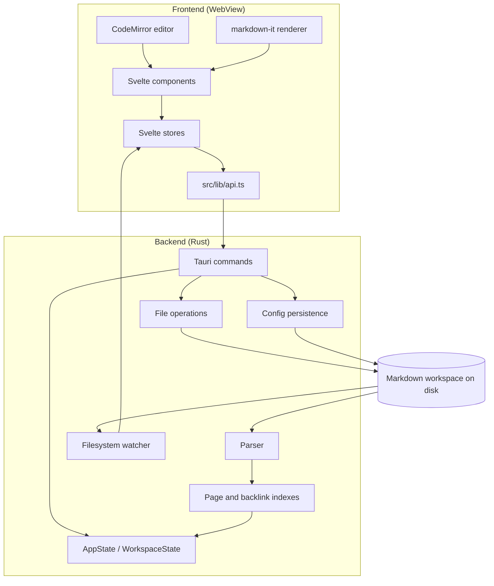

# Manicule Developer Notes

This document describes the technical architecture and test concept of Manicule.
It intentionally does not define product or functional requirements.

## Architectural Overview

Manicule is a local desktop application built with Tauri, Rust, Svelte, and
CodeMirror.

The central architectural decision is that Markdown files in the selected
workspace are the source of truth. Runtime indexes and UI state may be derived
from these files, but user content must remain recoverable from the Markdown
files alone.

At a high level the application is split into these layers:

- Tauri shell: desktop window, native menu, file dialogs, and command bridge
- Rust backend: workspace access, parsing, indexing, file operations, and config
  persistence
- Svelte frontend: three-pane UI, editor state, rendered views, context menus,
  task overview, and undo orchestration
- CodeMirror editor: Markdown editing surface and editor-local undo history

The runtime relationship between these layers:

Arrows show the intended direction of calls and data flow. The frontend reaches
the workspace only through Tauri commands, while the watcher pushes external
change events back into the frontend stores.

## Technology Stack

The stack is intentionally small. There is no database, no server component, and
no network dependency at runtime.

Frontend runtime dependencies:

- Svelte 5 as UI framework
- TypeScript as implementation language
- CodeMirror 6 (`state`, `view`, `commands`, `lang-markdown`, `autocomplete`)
  as the editing surface
- `markdown-it` 14 for rendered Markdown in read-only views
- `@tauri-apps/api` and `@tauri-apps/plugin-dialog` for the command bridge and
  native dialogs

Backend runtime dependencies (`src-tauri/Cargo.toml`, Rust edition 2021):

- `tauri` 2 for the desktop shell and command layer
- `tauri-plugin-dialog` 2 for native file dialogs
- `serde` and `serde_json` for DTO and config serialization
- `notify` 8 for workspace filesystem watching

Build and check tooling:

- Vite 6 with `@sveltejs/vite-plugin-svelte`
- `svelte-check` and TypeScript for static validation
- Node.js built-in test runner for frontend unit tests
- Cargo for backend build, tests, and the benchmark example

The project is licensed under AGPL-3.0-only. Frontend and backend crate versions
are kept in sync between `package.json` and `src-tauri/Cargo.toml`.

## Desktop Shell Configuration

The shell is configured in `src-tauri/tauri.conf.json`:

- product name `Manicule`, bundle identifier `dev.manicule.app`
- default window 1280x800 with a 960x600 minimum, resizable
- `beforeDevCommand` and `beforeBuildCommand` delegate to the npm scripts
- dev URL `http://localhost:1420`, production assets from `../dist`

The Vite dev server in `vite.config.ts` uses a strict port on `127.0.0.1:1420`
and ignores `src-tauri/**` so Rust rebuilds do not trigger frontend reloads.

Cargo explicitly declares the `Manicule` binary from `src/main.rs` and the
`manicule_lib` library from `src/lib.rs`. Command permissions are granted through
`src-tauri/capabilities/default.json`.

Performance measurements use the `reindex_benchmark` Cargo example. It is not
an additional application binary and does not alter the Tauri bundle targets.
Dataset definitions, commands, budgets, and recorded results are maintained in
`docs/performance-baselines.md`.

## Runtime Boundary

The frontend never accesses workspace files directly. All filesystem operations
go through Tauri commands exposed by the Rust backend.

The command boundary is defined in:

- `src/lib/api.ts`
- `src-tauri/src/lib.rs`
- `src-tauri/src/commands.rs`
- `src-tauri/src/config_commands.rs`

Frontend code calls typed helper functions in `src/lib/api.ts`, which forward
to Tauri `invoke` commands. Backend commands return DTOs from
`src-tauri/src/dto.rs` so the UI can update its local stores without knowing
Rust-internal data structures.

File and folder mutation failures use the structured Tauri error contract in
`src-tauri/src/app_error.rs`. The contract contains a stable category code, a
concise user-safe message, and optional technical detail. The current codes are
`invalid_path`, `not_found`, `conflict`, `already_exists`,
`folder_not_empty`, `io`, `state_lock`, and `internal`. Create, delete, move,
and rename commands are migrated; other command families still return strings
until they are migrated deliberately.

The frontend normalizes both shapes in `src/lib/errors.ts`. Components and
stores must preserve `detail` separately from the main message when they own an
error dialog. Technical details are collapsed by default and remain available
for diagnostics. Do not branch on message wording; use a stable error code when
behavior needs to differ by category.

## Workspace State

The backend holds the currently opened workspace in `AppState`.

Important backend structures:

- `AppState`: process-wide application state guarded for Tauri command access
- `WorkspaceState`: opened workspace root, workspace config, folders, page
  index, backlink index, and content snapshot
- `PageIndex`: in-memory index of Markdown pages by relative path and
  case-insensitive page key
- `BacklinkIndex`: in-memory index of wiki-link backlinks by target page key
- `ContentSnapshot`: disposable page content used by whole-workspace queries to
  avoid opening every Markdown file for every search or Task Overview load

Workspace state is rebuilt from disk when opening a workspace and after larger
file operations that can affect many paths.

## Backend Module Map

Top-level modules in `src-tauri/src`:

- `main.rs`, `lib.rs`: application bootstrap, plugin setup, native menu, and
  command registration
- `commands.rs`: page, navigation, task, and search commands
- `config_commands.rs`: user and workspace configuration commands
- `content_snapshot.rs`: derived Markdown content cache with disk fallback
- `app_state.rs`: process-wide guarded application state
- `dto.rs`: serializable types crossing the command boundary
- `workspace_index.rs`: full workspace scan and index construction
- `page_io.rs`: page content read and write with conflict metadata
- `page_ops.rs`: create, delete, move, rename, and link rewriting
- `page_view.rs`: rendered page payloads for the panes
- `query.rs`: search and task query behavior
- `navigation_order.rs`: sort modes and manual ordering rules
- `watcher.rs`: `notify`-based external change detection
- `user_config.rs`, `workspace_config.rs`: configuration persistence

Sub-packages:

- `parser/`: `blocks.rs`, `wiki_links.rs`
- `index/`: `page_index.rs`, `backlink_index.rs`
- `workspace/`: `scanner.rs` for recursive discovery, `paths.rs` for
  normalization and path-traversal prevention

## Workspace Scanning And Indexing

Workspace indexing starts in `src-tauri/src/workspace_index.rs`.

The scanner recursively finds Markdown files and folders below the workspace
root. The page index reads each Markdown file, extracts the first H1 heading as
the page title, and creates a case-insensitive page key from the relative path.

The backlink index parses each page into blocks and collects wiki links from
those blocks. For every link, it stores:

- the target page key
- the source page path and source page title
- the heading context at the source line
- the linking block including relevant parent and child context
- source line numbers for later navigation and highlighting

Indexes are intentionally in memory. They are derived data and can be rebuilt
from the workspace files.

A full reindex reads every Markdown file once and rebuilds page metadata,
backlinks, and the content snapshot together. `WorkspaceState` methods update or
remove those three derived representations as one operation after internal
writes. Workspace search and Task Overview use the snapshot, with a direct disk
read as a recovery path for a missing cache entry.

## Markdown Parsing

Markdown-specific parsing is split by concern:

- `src-tauri/src/parser/wiki_links.rs`: wiki-link parsing and link target
  rewriting
- `src-tauri/src/parser/blocks.rs`: block parsing, indentation hierarchy, task
  recognition, checkbox context, and child relationships
- `src-tauri/src/index/page_index.rs`: page title extraction and default H1
  generation
- `src-tauri/src/index/backlink_index.rs`: backlink collection from parsed
  blocks

The parser is intentionally lightweight and focused on the Markdown constructs
Manicule needs for indexing and editing operations. Full Markdown rendering is
handled in the frontend.

Rendered list items receive `data-list-marker` from their Markdown-it token.
The right pane disables native list markers and places CSS-drawn unordered
markers, fixed-width ordered markers, task checkboxes, and nested-list hierarchy
guides on one shared `em`-based axis. This avoids platform font metrics and keeps
the horizontal geometry stable when the application font size changes.

Page links are recognized in square (`[[page]]`), round (`((page))`), and compact
(`#page`) syntax. Compact targets are slash-separated, whitespace-free path
segments. The Rust parser and TypeScript live-preview scanner deliberately share
fixtures for valid links and exclusions such as headings, task priorities, URL
fragments, escaped hashes, inline code, and fenced code. Rename and move
operations preserve compact syntax when the replacement remains valid and fall
back to square syntax when a new target contains spaces.

## File Operations

Page and folder operations are implemented in `src-tauri/src/page_ops.rs`.

These operations are responsible for:

- validating workspace-relative paths
- preventing path traversal outside the workspace
- creating pages and folders
- deleting pages and empty folders
- moving and renaming pages or folders
- updating wiki links when pages or folders move
- refreshing indexes and folder lists after structural changes

The path helper functions in `src-tauri/src/workspace/paths.rs` are the
boundary for normalizing workspace-relative paths and resolving them safely
against the workspace root.

## Saving And Conflict Detection

Page content is read and written through `src-tauri/src/page_io.rs` and the
save command in `src-tauri/src/commands.rs`.

The frontend sends the expected file modification timestamp and content hash
when saving. The backend compares those values with the current disk state. If
the file changed externally, the backend returns a conflict instead of silently
overwriting the file.

After a successful save, the affected page is reindexed so backlinks, titles,
tasks, and rendered views can reflect the new content.

## Configuration Files

Manicule uses two configuration scopes.

User-level config:

- Stored in the user's home directory as `.manicule`
- Managed by `src-tauri/src/user_config.rs`
- Currently stores the last opened workspace path

Workspace-level config:

- Stored in the workspace root as `.config`
- Managed by `src-tauri/src/workspace_config.rs`
- Stores derived UI and workspace preferences such as task states, task colors,
  folder colors, expanded folders, favorites, recent pages, task overview
  filters, backlink view options, sort configuration, pane session state, and
  navigation layout values

The workspace config is normalized when loaded. Invalid or unknown values are
discarded or replaced with defaults where practical.

## Frontend Structure

The Svelte frontend is organized around components and stores.

Main application shell:

- `src/App.svelte`: three-pane layout, native menu event wiring, workspace
  session restore, column resizing, zoom handling, dialogs

The shell derives a CSS grid from the current column widths, clamps them against
per-pane minimum widths, and persists them in `localStorage` under
`manicule:layout:columns`. Pane file selection is persisted separately through the
workspace config, debounced before saving. On workspace change the shell ensures
today's journal page exists and opens it in the middle pane.

Primary components:

- `FileTree.svelte`: left navigation pane
- `NavigationTree.svelte`: recursive folder and page tree rendering
- `WorkspaceHeader.svelte`: workspace header and workspace-level actions
- `QuickAccess.svelte`: favorites, recent pages, and search entry points
- `EditorPane.svelte`: middle editor pane
- `RightPane.svelte`: right rendered context pane
- `TaskOverview.svelte`: task overview surface
- `TaskListPanel.svelte`: task list rendering inside the overview
- `LinkedReferences.svelte`: backlink rendering
- `MarkdownView.svelte`: rendered Markdown blocks, task controls, links, and
  checkboxes
- `CodeMirrorEditor.svelte`: CodeMirror integration
- `ContextMenuShell.svelte`, `NavigationContextMenu.svelte`: context menu
  infrastructure and navigation-specific menu entries
- `ErrorDialog.svelte`: error and conflict reporting

Shared accessibility infrastructure:

- `contextMenuKeyboard.ts` implements wrapped Up/Down traversal, Home/End,
  activation, Escape, and Left/Right submenu navigation for menus hosted by
  `ContextMenuShell.svelte`. Mnemonics use the same flyout-opening helper so
  mouse, letter, and arrow-key interaction keep one open-submenu state.
- `dialogFocus.ts` traps Tab navigation inside modal dialogs, closes them through
  their owner on Escape, and restores focus to an explicit invoking control or
  the previously focused connected element. Every `aria-modal="true"` dialog
  must use this action; non-modal popovers such as the journal date picker must
  not trap application focus.

Stores:

- `workspace.ts`: opened workspace metadata and workspace config mirrors
- `editorSession.ts`: middle-pane editor file, content, save state, and
  navigation history
- `createEditorSessionStore.ts`: shared factory behind the editor session and
  right-pane session behavior
- `rightPane.ts`: right-pane file, rendered view, and navigation history
- `mainView.ts`: editor versus task overview mode
- `editorMode.ts`: source versus live preview editing mode
- `tasks.ts`: task overview data and updates
- `appUndo.ts`: global undo/redo actions outside CodeMirror-local editing
- `appErrors.ts`: app-wide popup reporting for otherwise-unhandled direct user
  actions and infrastructure calls
- `linkOperations.ts`: shared wiki-link target normalization, pane routing, and
  create-and-open sequencing
- `navigationHistory.ts`: shared back/forward stack transitions and derived
  navigation availability
- `mutationOperations.ts`: shared checkbox, task status, and task priority
  orchestration for rendered views and Task Overview
- `theme.ts`: light and dark appearance state
- `zoom.ts`: UI zoom factor

Domain logic is kept in framework-free TypeScript modules under `src/lib` so it
can be unit tested without rendering components:

- linking and navigation: `wikiLinks.ts`, `wikiLinkCompletion.ts`,
  `backlinkGroups.ts`, `navigationTree.ts`, `journals.ts`
- tasks and presentation: `taskKeywords.ts`, `taskColors.ts`, `checkboxes.ts`,
  `folderColors.ts`, `taskCompletionSound.ts`
- editor behavior: `editorLivePreview.ts`, `editorBlockCommands.ts`,
  `editorBlockFolding.ts`, `editorLineWrapping.ts`, `editorTextFormatting.ts`
- rendering and infrastructure: `markdownRendering.ts`, `markdownSourceLines.ts`,
  `api.ts`, `types.ts`, `coreEvents.ts`, `keyboardShortcuts.ts`,
  `menuMnemonics.ts`, `contextMenuPosition.ts`, `dialogFocus.ts`

## Rendering Model

The middle editor is CodeMirror-based.

In source mode, CodeMirror shows plain Markdown text. In live mode, inactive
lines are visually rendered while the active line remains editable Markdown
source. This hybrid behavior is implemented mostly in:

- `src/lib/editorLivePreview.ts`
- `src/lib/markdownRendering.ts`
- `src/lib/editorBlockCommands.ts`
- `src/lib/editorLineWrapping.ts`

The right pane and backlink sections use rendered Markdown components rather
than CodeMirror.

Markdown rendering and editing behavior are intentionally separate from backend
indexing. The backend parses only the structures needed for file operations and
derived indexes.

## Undo And Redo

CodeMirror owns editor-local text undo and redo while a file is open in the
middle pane.

The global stack records an editor marker only when CodeMirror's `undoDepth`
actually increases. Do not reintroduce a separate time-based grouping heuristic:
CodeMirror decides which typing transactions form one undo group. Every rendered
checkbox or task mutation isolates the active editor history before and after the
operation, even when the mutation targets another file. This keeps sequences such
as editor edit, right-pane checkbox, editor edit aligned across both histories.
When such a mutation targets the open editor page, synchronize its new content as
the smallest contiguous CodeMirror change with `addToHistory` disabled. Replacing
the complete document would overlap and invalidate otherwise unrelated editor
history entries.

Application-level changes outside direct editor typing are recorded in
`src/lib/stores/appUndo.ts`. Examples include checkbox toggles, task state
changes, and task priority changes made from rendered views or the task
overview.

The application-level undo store exposes injectable effect dependencies for
tests. `tests/appUndo.test.ts` is the behavioral contract for ordering mixed
editor and rendered-view changes, routing mutations through an open editor or
directly to disk, and retaining an operation when its save fails. Refactors of
task or checkbox orchestration should keep these tests unchanged unless the
user-visible undo policy is intentionally changed.

Forward mutations initiated outside CodeMirror go through
`src/lib/stores/mutationOperations.ts`. This layer decides whether the target
is the open editor page or a disk-backed page, isolates active editor history, waits
for save success, records one global undo operation, refreshes derived views,
and gates the task completion sound. Svelte components retain presentation and
menu state but do not duplicate this orchestration.

The native Edit menu is synchronized from the frontend so menu labels and
enabled states reflect the current undo/redo action.

## Async Error Ownership

Errors are surfaced at the narrowest layer that owns the operation:

- Store actions catch operational failures and expose them through their own
  state for the nearest `ErrorDialog`. Callers must not wrap these actions in a
  second reporter because that would create duplicate or misleading popups.
- Direct native user actions and infrastructure calls without a store-owned
  error path run through `runUserAction` in `src/lib/stores/appErrors.ts`. A
  rejected promise is converted to one contextual app-wide popup.
- Structured backend failures retain their technical detail through the owning
  store. `ErrorDialog` keeps that detail behind a collapsed disclosure so the
  actionable message remains primary.

The app-wide boundary currently covers native event initialization, workspace
picker and close actions, undo/redo warnings, and window-title updates. Menu
label synchronization and completion-sound playback are intentional
best-effort effects; their failures do not invalidate the completed user
operation and remain non-blocking.

## Watcher And External Changes

The backend starts a workspace watcher from `src-tauri/src/watcher.rs` when a
workspace opens. It retains normalized Markdown paths and event kinds across a
400 ms debounce window. Ordinary file create, modify, remove, and rename events
incrementally update only affected pages; folder renames, ambiguous events, and
watcher errors use a full rebuild. An incremental failure also falls back to a
full rebuild before any frontend index event is emitted. Scanner visibility
remains authoritative, so symlinks and ignored build directories cannot enter
through the incremental path.

The watcher ignores events from a previous workspace after the application has
switched roots. It emits frontend events when the current workspace's derived
state has been updated successfully.

The workspace `.config` file is loaded when the workspace opens and is persisted
through dedicated Tauri commands; external `.config` changes are not watched or
merged while the workspace is open.

The frontend responds by refreshing workspace data or warning about changed
files depending on the active editing state.

Watching `.config` later would require an explicit reload/merge policy and
suppression of events caused by Manicule' own config writes. It should therefore
be introduced as a separate feature rather than added to the Markdown watcher
implicitly.

## Navigation And Ordering

The left pane builds its tree from the page and folder lists returned by the
backend. Ordering combines default sort mode, per-folder sort mode, manual order
configuration, and recent/favorite metadata.

Page and wiki-link keys are matched with Unicode lowercasing. This is not
locale-specific comparison or full Unicode case folding. Physical folders that
differ only by case are kept as separate scanner entries and sorted by the
lowercase key with the exact path as a deterministic tie-breaker; Manicule does
not silently discard either filesystem entry.

Navigation helper logic lives mostly in:

- `src/lib/navigationTree.ts`
- `src/lib/components/NavigationTree.svelte`
- `src-tauri/src/navigation_order.rs`

Wiki-link navigation from CodeMirror, rendered Markdown, backlinks, and Task
Overview routes through `src/lib/stores/linkOperations.ts`. Callers pass the
target pane explicitly, so middle- and right-pane defaults remain visible at
the UI boundary. The operation normalizes the Markdown path, activates the
editor view when requested, forwards line and history options, and sequences
missing-page creation before source refresh and navigation. Components retain
ownership of confirmation UI and pane-specific refresh behavior.

The middle and right pane share only their back/forward stack mechanics through
`src/lib/stores/navigationHistory.ts`. Each pane still owns loading, content,
line targeting, request cancellation, and errors; the editor additionally owns
dirty state, saves, and conflict handling. A stack transition is committed only
after the owning store reports that its target opened successfully. Failed
navigation therefore preserves both the current page and the previous history.

Backlink display can use page order information so linked references follow the
same navigational structure as the left pane.

## Build And Test Structure

Frontend build tooling:

- Vite
- Svelte
- TypeScript
- `npm run dev` starts the Vite dev server on `127.0.0.1:1420`
- `npm run test:frontend` compiles `tsconfig.test.json` into `.tmp-tests` and
  runs the compiled tests with the Node.js built-in test runner
- `npm run check` for Svelte and TypeScript validation
- `npm run build` for production frontend build validation

TypeScript configuration is split across `tsconfig.json` for application code,
`tsconfig.node.json` for build tooling, and `tsconfig.test.json` for the test
compilation step.

Backend build tooling:

- Rust
- Cargo
- Tauri
- `cargo test` inside `src-tauri`

The repository also contains a Rust benchmark binary:

- `src-tauri/examples/reindex_benchmark.rs`

Because there is more than one Rust binary target, plain `cargo run` inside
`src-tauri` is ambiguous. Use the Tauri dev command for application development
or specify a binary explicitly when running Cargo directly.

## Test Concept

The test strategy follows the architecture boundary. Pure parsing, indexing,
ordering, rendering, and editor-helper behavior should be tested with fast unit
tests. Native shell behavior and complete user workflows are validated manually
or with higher-level integration checks when needed.

Frontend tests:

- TypeScript unit tests live in `tests/*.test.ts`.
- Tests focus on deterministic UI helper logic rather than browser rendering.
- Covered areas include wiki-link completion, Markdown rendering helpers,
  backlink grouping, navigation tree building, folder colors, task keyword
  parsing, checkboxes, journal path handling, editor block commands, editor
  live preview behavior, editor sessions, CodeMirror history grouping,
  application undo ordering, shared
  mutation orchestration, task completion sound gating, line wrapping, and
  version metadata. Direct async action errors are covered for contextual,
  single reporting without re-reporting store-handled outcomes. Link-operation
  tests cover pane routing, navigation options, canonical created paths, and
  unsuccessful page creation. Shared navigation-history tests cover stack
  transitions, availability flags, duplicate suppression, forward-history
  invalidation, clearing, and failed pane navigation. Context-menu tests cover
  wrapped navigation and disabled entries for root, Status, Priority, Color,
  and Sort menus; dialog-focus tests cover safe focus restoration when invoking
  controls have been removed.
- Run frontend tests with `npm run test:frontend`.
- Run static Svelte and TypeScript checks with `npm run check`.

Shared Markdown contract fixtures:

- `tests/fixtures/markdown-rules.json` is the executable contract for Markdown
  rules implemented by both Rust and TypeScript. Its `shared` section covers
  source-level behavior such as wiki-link normalization, task and priority
  recognition, list and checkbox prefixes, indentation, and block structure.
- Define or update the expected fixture before changing a shared Markdown rule.
  Then update both implementations and keep
  `tests/markdownRulesFixtures.test.ts` plus the Rust fixture consumers in
  `parser/blocks.rs`, `parser/wiki_links.rs`, and `workspace/paths.rs` green.
- Presentation-only expectations belong in `frontendOnly`. Do not add rendered
  labels, HTML, CSS, or CodeMirror decoration details to `shared` merely to make
  Rust reproduce frontend presentation behavior.
- Keep representative examples directly in the fixture. Use parameterized
  generated cases for large or deeply nested documents so the JSON remains
  readable and both test suites construct equivalent input.
- When Rust and TypeScript intentionally differ, document the architectural
  reason and place the expectation on the owning side instead of weakening a
  shared assertion.
- Changes to the fixture require both `npm run test:frontend` and `cargo test`
  from `src-tauri`; run `npm run check`, `cargo fmt --check`, and
  `git diff --check` before committing.

Error-contract tests:

- Rust tests in `src-tauri/src/app_error.rs` lock the serialized field names and
  stable code values. File-operation tests should assert categories and
  technical details separately instead of matching complete user messages.
- Frontend tests in `tests/errors.test.ts` cover structured, legacy string, and
  unknown rejection shapes. `tests/appErrors.test.ts` verifies that one rejected
  action produces one contextual report while preserving technical detail.
- When migrating another Tauri command family, add category assertions at the
  Rust boundary first, keep unknown frontend errors visible, and verify the
  owning component does not also route the same failure through the global
  reporter.

Backend tests:

- Rust tests live next to the modules they validate.
- Tests should cover path normalization, page-key resolution, page indexing,
  default H1 generation, backlink parsing, block parsing, task recognition,
  link rewriting, file operations, config normalization, and query behavior.
- Run backend tests with `cargo test` from `src-tauri`.

Build validation:

- `npm run build` validates the frontend production bundle.
- `npm run tauri build` validates the packaged desktop app and Rust release
  build.
- Platform-specific package behavior should be checked on the target operating
  system before release.

CI and release automation are intentionally separate:

- `.github/workflows/ci.yml` runs on supported short-lived branches, `main`, and
  pull requests targeting `main`. Every event executes frontend checks and
  tests plus Rust formatting and tests. Pushes additionally build Windows,
  macOS, and Linux artifacts with a short retention period; pull requests check
  the proposed merge without repeating that Tauri build matrix. The workflow
  has read-only repository permissions and never creates a release.
- Push and pull-request runs use separate concurrency groups. A new commit may
  cancel an obsolete run of the same event type, but a pull-request check must
  not cancel the platform builds started by the corresponding branch push.
- `.github/workflows/release.yml` runs only for tags. It validates strict
  `vMAJOR.MINOR.PATCH` syntax, verifies that source versions match the tag and
  that the commit belongs to `main`, then rebuilds every platform. The final job
  receives write permission and publishes a GitHub Release only after all build
  jobs have succeeded.
- CI and release job names are part of the branch-protection contract. Rename
  them only together with the required status checks configured on GitHub.
- Cross-platform dependencies and build targets must stay synchronized between
  CI and release workflows. CI may use smaller native bundles; releases retain
  the full distributable package set.

Manual acceptance checks:

- Workspace open, close, and restore behavior
- Daily journal creation on startup
- Middle-pane editing, autosave, manual save, and conflict handling
- Right-pane rendering and independent navigation
- Backlinks in middle and right panes
- Task status and priority changes from rendered views and task overview
- Checkbox toggles from middle and right panes
- File and folder create, rename, move, delete, and link rewrite behavior
- Native menu shortcuts on macOS, Windows, and Linux

Regression rule:

- Every fixed bug should get the narrowest practical automated test unless the
  behavior depends on native menus, OS dialogs, or visual layout that is not
  currently covered by the test stack.

## Dependency Direction

The intended dependency direction is:

1. UI components call frontend stores or typed API helpers.
2. Frontend stores call `src/lib/api.ts`.
3. API helpers invoke Tauri commands.
4. Commands delegate to focused backend modules.
5. Backend modules read or write Markdown files and update derived indexes.

Rendering code should not perform filesystem work. Backend parsing should not
depend on frontend rendering behavior.

## Design Constraints

Technical changes should preserve these constraints:

- Markdown files remain the durable source of truth.
- Indexes are rebuildable derived state.
- Paths passed from the UI are workspace-relative and must be normalized before
  filesystem access.
- Case-insensitive page resolution is part of the link model.
- File operations that move or rename pages must update existing wiki links.
- Frontend state should be synchronized from backend DTOs after file operations.
- CodeMirror editor history and global application undo history are related but
  separate mechanisms.
