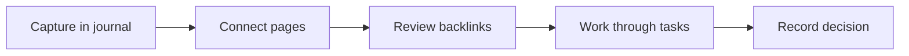

# Markdown Showcase

This page is a small rendering playground. It stays separate from the operational notes so the example workspace remains useful rather than becoming a feature catalogue.

## Decision snapshot

| Signal | Current reading | Decision use |
| --- | ---: | --- |
| Average late-shift wait | 18 min | Baseline for [[projects/DockFlow Hamburg]] |
| Pilot gates | 1 | Keep [[projects/SlotPilot]] intentionally small |
| Open steering questions | 2 | Resolve in [[meetings/Ops Steering]] |

Inline formulas remain part of ordinary prose: an improvement from $18$ to $12$ minutes is a $\frac{18-12}{18}=33\%$ reduction.

$$
\text{average wait} = \frac{\sum_{i=1}^{n} \text{wait}_i}{n}
$$

## From capture to decision

Mermaid diagrams render in the right pane:

## Try the rendered view

- [ ] Toggle this checkbox in the right pane.
- Select and copy text from this page.
- Open [[people/Laura Stein]] without replacing the editor.
- Paste a local image into this page in the editor; Logtext stores it in `media/` and inserts the Markdown reference.

> Markdown files remain the source of truth. Every interaction on this page updates ordinary Markdown that can be opened in another editor.
