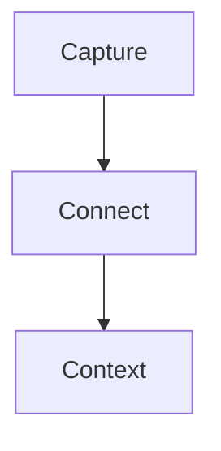

# Logtext Manual

Logtext is a local, Markdown-first workspace for notes and tasks. Markdown files
are canonical. Workspace configuration is stored in a readable JSON file; no
database is required for primary content.

This manual describes the current application. For build instructions and
contribution rules, see [CONTRIBUTING.md](../CONTRIBUTING.md).

## Logtext in Five Minutes

1. Open an existing folder or a new empty folder as a workspace.
2. Capture notes in today's journal. Use list blocks when an item may gain
   details, links, or tasks later.
3. Connect people, projects, and topics with `[[page]]` or `#page`. The target
   page does not need to exist yet.
4. Open a linked page in the right pane to keep writing in the editor while
   reviewing its backlinks and surrounding context.
5. Prefix actionable blocks with `TODO`, `INPROGRESS`, `WAITING`, or `DONE`,
   then use Task Overview to filter and group work across the workspace.

This is the core loop: capture first, connect while writing, and retrieve later
through links, backlinks, search, and tasks.

## Contents

- Getting started: [Installation](#installation), [First Start](#first-start),
  and [Workspace Files](#workspace-files)
- Core workflow: [Three-Pane Layout](#three-pane-layout), [Journals](#journals),
  [Wiki Links and Tags](#wiki-links-and-tags), [Backlinks](#backlinks), and
  [Editing](#editing)
- Tasks and content: [Tasks](#tasks), [Checkboxes](#checkboxes),
  [Images and Media](#images-and-media), [LaTeX](#latex), and
  [Mermaid](#mermaid)
- Finding and navigating: [Keyboard-First Navigation](#keyboard-first-navigation),
  [Navigation and File Operations](#navigation-and-file-operations),
  [Search](#search), and [Keyboard Shortcuts](#keyboard-shortcuts)
- Configuration and reference: [Workspace Preferences](#workspace-preferences),
  [Markdown and Data Details](#reference-markdown-and-data-details),
  [Data Safety](#data-safety), and [Current Limitations](#current-limitations)

## Installation

Release files are published under
[GitHub Releases](https://github.com/elliptical-cow/logtext/releases/latest).
The version in an asset name is written as `<version>` below; for example,
version `0.8.5` appears as `v0.8.5`.

### Windows

Choose one of these files:

- `Logtext-v<version>-windows-x86_64-setup.exe`: NSIS installer
- `Logtext-v<version>-windows-x86_64-portable.exe`: directly executable build

Run the installer for a normal installation. Use the portable executable when
you do not want an installed copy.

### macOS

Download `Logtext-v<version>-macos-universal-app.zip`, extract it, and move
`Logtext.app` to `Applications`. The application bundle supports Intel and Apple
Silicon Macs.

### Debian and Ubuntu

Download `Logtext-v<version>-linux-x86_64.deb` and install it through APT:

```bash
sudo apt install ./Logtext-v<version>-linux-x86_64.deb
```

APT installs declared system dependencies through the package manager.

### Linux AppImage

The AppImage is the portable Linux fallback:

```bash
chmod +x Logtext-v<version>-linux-x86_64.AppImage
./Logtext-v<version>-linux-x86_64.AppImage
```

### Thin Linux Archive

`Logtext-v<version>-linux-x86_64-thin.tar.gz` contains the native executable
without bundled GTK or WebKitGTK libraries. It is intended for experienced
Linux users and requires a system compatible with the Ubuntu 22.04 build
baseline, including WebKitGTK 4.1, GTK 3, and related runtime libraries.

Extract the archive and check its included `README.txt` for current
prerequisites and limitations.

## First Start

1. Select `File > Open Workspace Folder...`.
2. Choose an existing folder or a new empty folder.
3. Logtext scans all Markdown files below that folder.
4. The editor opens today's journal page.

If `<journalFolder>/YYYY-MM-DD.md` does not exist, Logtext creates it. The
default journal folder is `journal`.

The included [example workspace](example_workspace) demonstrates journals,
backlinks, tasks, favorites, folder colors, and the three-pane layout. Open the
folder itself as a workspace and begin with
[Start Here](example_workspace/Start%20Here.md).

## Workspace Files

A workspace is an ordinary directory. Its important contents are:

```text
workspace/
  .config
  journal/
    2026-09-12.md
  media/
  projects/
    Project Alpha.md
```

- Markdown pages may be organized in arbitrary folders, except inside the
  journal and media folders.
- `.config` contains workspace-specific settings and UI state.
- `journal/` contains dated journal pages by default.
- `media/` contains pasted images by default.

Logtext also stores the last workspace path in `~/.logtext`. On startup it
reopens that workspace if it is still available. The right pane restores its
previous context page.

## Three-Pane Layout

The window has three resizable panes:

- **Left:** file tree, journal navigation, favorites, recent files, task overview,
  and workspace search.
- **Middle:** the active Markdown editor or Task Overview.
- **Right:** an independently navigable rendered page, journal feed, and linked
  references.

The middle and right panes may show different files. This allows editing one
page while keeping another page or a backlink target visible.

Use the `View > Hide/Show Panes` submenu to collapse the left, middle, or right
pane into a narrow rail and give the other panes more room. The shortcuts are
`Cmd/Ctrl+Alt+L`, `Cmd/Ctrl+Alt+M`, and `Cmd/Ctrl+Alt+R`, respectively. The plus
button in the rail or the corresponding submenu item restores a pane. Panes
remain mounted, so their open page, editor/preview state, scroll position, and
width are retained. Pane visibility is stored in the workspace `.config`.

Use `View > Reset Column Layout` to show all three panes and restore their
default sizes.

## Journals

Journal pages provide the default capture workflow.

- Default folder: `journal`
- Required filename format: `YYYY-MM-DD.md`
- Only valid calendar dates directly inside the journal folder count as journal
  pages.
- The journal folder cannot contain subfolders.
- Yesterday, Today, Tomorrow, and Pick controls are available in the left pane.

The configured page sort order determines journal navigation order.
`Modified` ordering uses each Markdown file's filesystem modification time;
`Recently opened` uses the workspace-local opening history.

### Right-Pane Journal Feed

When a journal page is opened in the right pane, dated pages are presented as a
continuous rendered feed. Scrolling past the current entry loads adjacent
journal entries in the configured ascending or descending order.

Disable the continuous journal feed under `Preferences > Journal` to show only
the selected journal page.

The middle pane edits one Markdown file at a time. Mouse-wheel and Page Up/Page
Down scrolling stay within that file. Use the journal controls or pane history
to open another journal entry.

## Pages and Titles

New pages receive a first-level heading based on the filename:

```md
# Project Alpha
```

The first `# Heading` is the page title used in tasks, backlinks, and content
context. The left file tree continues to show the filename. For an existing
file without an H1, Logtext initially uses the filename without `.md`; opening
that file adds a default H1.

## Wiki Links and Tags

Internal links use wiki-link or compact hashtag syntax:

```md
[[Project Alpha]]
[[projects/Project Alpha]]
[[projects/Project Alpha|Alpha]]
#Project-Alpha
#projects/Project-Alpha
```

Rules:

- Targets are matched case-insensitively.
- Actual filesystem spelling is not changed.
- A trailing `.md` in a target is tolerated but normally omitted.
- `[[path/Page|label]]` assigns a display label.
- `#link` supports letters, numbers, `_`, `-`, internal dots, and `/` between
  path segments.
- Compact hashtags cannot contain spaces.
- Selecting a page with spaces from `#` autocomplete replaces the input with a
  `[[target]]` link.
- Markdown headings, task priorities such as `[#A]`, URL fragments, escaped
  links, standard Markdown link labels and targets, LaTeX, and code are not
  interpreted as page links.
- `((...))` is ordinary text and is not an alias for `[[...]]`.

Typing `[[` or a compact `#` target opens page suggestions. Suggestions show
the full workspace-relative page path. If page names are unique, rendered links
may use the shorter page name; ambiguous names retain enough path context to be
distinguishable.

Missing targets are marked in rendered views and can be created explicitly.

When a page or folder is renamed or moved through Logtext, matching wiki links
and related configuration paths are updated.

## Backlinks

A block containing a page link becomes a linked reference on the target page.
Backlinks are calculated from Markdown and are not written into page files.

An explicit wiki link inside a block attribute refers to the block that owns
the attribute. The linked reference therefore contains that complete block:

```md
- Project planning
  - owner:: [[people/Peter]]
  - Remember budget review
```

This produces one linked reference on `people/Peter.md` containing all three
lines. A plain value such as `owner:: Peter` remains text and does not create a
backlink.

A linked reference can contain:

- source path and page title
- surrounding heading path
- the linking block
- relevant parent and child blocks

Linked References may appear in the right pane and below the middle editor. The
middle-pane section starts expanded. `Open Tasks only` limits results to
references whose block or child blocks contain an open task.

References follow the same configured folder and page order as the file tree,
then their order in the source file. This includes the `Recently opened` sort
mode.

Rendered backlink blocks use the same contextual actions in both content panes.
Right-click a task keyword to change its Status or Priority. In the middle pane,
`Show line in right pane` opens the source context opposite the editor; in the
right pane, the corresponding action opens it in the editor. Rendered
checkboxes can be toggled directly, and selected backlink text can be copied.

## Editing

The middle pane uses CodeMirror and supports normal Markdown editing plus block
operations.

Common block actions:

- `Enter`: create another list item
- `Tab`: indent the current or selected block
- `Shift+Tab`: outdent the current or selected block
- `Cmd/Ctrl+ArrowUp`: move a block and its children up
- `Cmd/Ctrl+ArrowDown`: move a block and its children down
- `Cmd/Ctrl+1` through `Cmd/Ctrl+4`: collapse blocks below that level
- `Cmd/Ctrl+Shift+E`: expand all blocks

Use `View > Plain markdown edit` or `Cmd/Ctrl+Shift+L` to switch between live
preview and plain Markdown. In live preview, Markdown markers are reduced on
inactive lines and restored when editing requires their source.

Press `Cmd/Ctrl+Alt+Right` to show the current editor line in the right pane.
The editor keeps focus, so the right pane can provide rendered context while
you continue writing.

Exact live-preview syntax, escaping, and code-block behavior are collected in
[Markdown Rendering Details](#markdown-rendering-details).

### Undo and Redo

Direct editor changes use CodeMirror undo. Task and checkbox changes made in
rendered views use Logtext's application-level undo stack. The Edit menu names
the next application action when available.

Undoing a task-state change also restores the previous
`status-changed-at::` line exactly. If the state change created that attribute,
undo removes it again. Undo is blocked if that attribute was edited separately
after the state change, so the newer Markdown is not overwritten.

- Undo: `Cmd/Ctrl+Z`
- Redo: `Cmd/Ctrl+Shift+Z` or `Cmd/Ctrl+Y`

## Tasks

Tasks are Markdown lines or list items beginning with a configured state:

```md
TODO Capture a task without a list marker
- TODO Prepare project review
- INPROGRESS [#A] Write decision note
- WAITING[#B] Feedback from stakeholder
- DONE Close release checklist
```

The state must begin the line or the text of a list item. A keyword later in an
ordinary sentence is not interpreted as a task.

Default states:

- `TODO`
- `INPROGRESS`
- `WAITING`
- `DONE`

Use `Cmd/Ctrl+Enter` in the editor to add or cycle a task state. A right click
on a rendered task keyword opens a compact menu for Status, Priority, and
showing the source line in the other pane.

Changing a task to the final configured state may play a completion sound.
Disable it under `Preferences > Tasks` when no sound is wanted.

State changes also maintain `status-changed-at::` metadata. The exact source
format, conversion rules, and attribute inheritance behavior are described in
[Task Metadata and Block Attributes](#task-metadata-and-block-attributes).

### Priorities

Supported priority cookies are `[#A]`, `[#B]`, and `[#C]`:

```md
- TODO [#A] High priority
- TODO[#B] Compact task-state syntax
```

The space between task state and priority is optional.

### Task Overview

Open Task Overview from the left pane or with
`View > Show Task Overview` (`Cmd/Ctrl+Shift+T`). It supports:

- status, priority, text, linked-page, and attribute filters
- combining all active filters with AND
- finding tasks that have, contain, or are missing a selected attribute
- grouping by status, priority, source, folder, linked page, or attribute
- inherited linked-page and effective attribute context from all parent blocks

Each task row shows its effective attributes in a compact metadata line.
Inherited values carry a small inheritance marker and source-line tooltip.
`status-changed-at` is shown in local time while the Markdown source remains a
UTC timestamp.

Task Overview remembers its active filters and grouping in the current
workspace's `.config`.

Clicking the task card, including its status or priority marker, opens and
highlights its source context in the right pane. Links and the `Edit` button
retain their own actions. Right-click the status or priority marker to open the
task menu. `Edit` opens the source in the middle pane and selects its line.

## Checkboxes

Standard Markdown checkboxes are rendered and clickable in the middle and right
panes:

```md
- [ ] Open item
- [x] Completed item
```

Clicking a rendered checkbox updates the source Markdown file.
Checkboxes also remain interactive in blockquotes and in loose list items that
contain additional paragraphs.

## Images and Media

Paste a PNG, JPEG, WebP, or GIF image of up to 20 MiB from the clipboard into an
open page. Logtext stores it in the configured media folder and inserts a
workspace-relative Markdown reference at the current selection:

```md

```

Image filenames and safe workspace-relative path rules are documented in
[Workspace Image Paths](#workspace-image-paths).

Images are rendered in editor live preview, the right pane, journal feeds,
backlinks, and Task Overview.

### Resize an Image

Hover over an image in editor live preview. The `-` and `+` controls in its
upper-left corner change the width in 20–25 percent steps. The width is stored
in the optional Markdown image title; an existing title is preserved.

The aspect ratio is fixed. Images wider than the pane remain constrained to the
available pane width.

### Copy an Image

Right-click a workspace image and select `Copy image` to place the image itself
on the operating-system clipboard. The action is available in editor live
preview and rendered views. It does not apply to external image paths.

### Clean Media

Removing a Markdown image reference does not automatically delete the file.
Use `File > Clean Media...` to scan for supported image files that are no longer
referenced.

Logtext shows the candidates in a scrollable confirmation dialog. `Move to
Trash` sends confirmed files to the operating-system trash; `Cancel` makes no
changes.

## LaTeX

KaTeX renders inline and block formulas:

```md
Energy is $E = mc^2$.

$$
\int_0^1 x^2 \, dx
$$
```

Invalid formulas remain visible as source text without preventing the rest of
the page from rendering.
An unfinished `$$` block remains editable source and does not consume the rest
of the document as a preview formula.

In editor live preview, formulas are rendered on inactive lines. Selecting an
inline formula restores its source line. Selecting any line in a block formula
restores the complete `$$...$$` block for editing.

## Mermaid

The right pane renders fenced `mermaid` code blocks:

````md

````

This applies to pages, the continuous journal feed, and linked references.
Diagrams are rendered when they approach the visible area. Theme changes
rerender visible diagrams with matching colors.

Current limitations:

- Mermaid source remains a fenced code block in the middle editor.
- Invalid Mermaid syntax remains visible with a local error message.

## Keyboard-First Navigation

Logtext keeps a small set of global shortcuts for frequent navigation and uses
the Command Palette for less common actions.

- `Cmd/Ctrl+P` opens Quick Open. Type any part of a page name or full
  workspace-relative path, use the arrow keys to choose a result, then press
  `Enter` for the editor or `Shift+Enter` for the right pane.
- `Cmd/Ctrl+Shift+P` opens the Command Palette. It searches file, journal,
  task, pane, view, theme, settings, maintenance, and help actions. Commands
  that require a workspace, editor, or selected navigation item are available
  only in the matching context.
- `F6` and `Shift+F6` move focus through the visible left, middle, and right
  panes. Hidden panes are skipped, and each pane remembers its most recently
  focused control.
- `Cmd/Ctrl+Shift+F` moves directly to workspace search. `Escape` clears an
  active search and returns focus to the file tree.
- `Alt+Left` and `Alt+Right` navigate the history of the focused editor or
  right pane.

Trees, result lists, Task Overview, and the date picker use one `Tab` stop each.
Move within them with arrow keys instead of tabbing through every row. Use
`Shift+F10` or the Menu key for context actions. The complete shortcut reference
appears under [Keyboard Shortcuts](#keyboard-shortcuts) and in
`Help > Keyboard Shortcuts`.

## Navigation and File Operations

The left pane contains a compact file tree. Files are sorted by descending name
by default. Each folder may override that order. `Recently opened` places pages
opened in either content pane first; pages without history follow by name.

Actions include:

- open a page in the editor
- open a page in the right pane
- add or remove a favorite
- create, rename, move, and delete pages and folders
- move pages with drag and drop
- assign a folder color
- choose ascending, descending, modified-time, or recently-opened sorting and
  reorder items manually

Use `Ctrl/Cmd+click` to select separate tree items or `Shift+click` to select a
range. The selection can then be moved or deleted together from its context
menu. Deleting pages requires confirmation; folders can be deleted only when
they are empty.

File and folder context menus contain secondary actions. Normal left-click
behavior is not repeated unnecessarily.

Folder colors apply to the folder icon and to links targeting pages below that
folder. The default link chip remains light blue with dark blue text.

Logtext updates matching wiki links when pages or folders move. Workspace-rooted
image references do not need rewriting.

## Search

### Current File

Press `Cmd/Ctrl+F` in the editor to search the current Markdown file. Expand the
search panel to show replacement controls. Replacements are normal editor
changes and participate in dirty-state handling, Save, and undo.

### Workspace

Use the search field in the left pane to search indexed Markdown files. Results
include file, line, and context. Select a result to open it in the editor, or use
its `R` action to open and reveal the matching line in the right pane.

## Context Menus

Context menus depend on the clicked content.

Editor examples:

- text operations: Cut, Copy, Paste, Select All
- selection formatting, including linking the selection as a page
- wiki links: follow the link in another pane, copy the wikilink, or show its
  source line in the right pane
- task keywords: Status, Priority, Show line in right pane
- blocks: block-specific formatting and navigation

Right-pane examples:

- Copy selected text
- wiki links: follow the link in the editor or show its source line there
- task keywords: Status, Priority, Show line in editor
- Copy image for workspace images

Where an exact keyboard equivalent exists, the menu shows a subtle Windows-style
hint such as `Ctrl+C` or `Shift+Tab`.

## Keyboard Shortcuts

Open `Help > Keyboard Shortcuts` for the list shipped with the running version.

Logtext uses one sequential tab stop for long trees and lists. After tabbing to
the file tree, Quick Access, search results, Task Overview, or the date picker,
use the arrow keys to move inside that control. This avoids stepping through
every row and every secondary icon with `Tab`. A visible focus ring always shows
the current target.

| Action | Shortcut |
| --- | --- |
| Focus next/previous visible pane | `F6` / `Shift+F6` |
| Quick Open page | `Cmd/Ctrl+P` |
| Command Palette | `Cmd/Ctrl+Shift+P` |
| Focus workspace search | `Cmd/Ctrl+Shift+F` |
| Back/forward in focused content pane | `Alt+Left` / `Alt+Right` |
| Show current editor line in right pane | `Cmd/Ctrl+Alt+Right` |
| New file | `Cmd/Ctrl+N` |
| Open workspace | `Cmd/Ctrl+O` |
| Close workspace | `Cmd/Ctrl+Shift+W` |
| Save | `Cmd/Ctrl+S` |
| Workspace preferences | `Cmd/Ctrl+,` |
| Undo | `Cmd/Ctrl+Z` |
| Redo | `Cmd/Ctrl+Shift+Z` or `Cmd/Ctrl+Y` |
| Search current file | `Cmd/Ctrl+F` |
| Add or cycle task state | `Cmd/Ctrl+Enter` |
| Toggle Task Overview | `Cmd/Ctrl+Shift+T` |
| Toggle editor mode | `Cmd/Ctrl+Shift+L` |
| Show/hide left pane | `Cmd/Ctrl+Alt+L` |
| Show/hide middle pane | `Cmd/Ctrl+Alt+M` |
| Show/hide right pane | `Cmd/Ctrl+Alt+R` |
| Expand all blocks | `Cmd/Ctrl+Shift+E` |
| Collapse below levels 1–4 | `Cmd/Ctrl+1` through `Cmd/Ctrl+4` |
| Move block up/down | `Cmd/Ctrl+ArrowUp` / `Cmd/Ctrl+ArrowDown` |
| Indent/outdent | `Tab` / `Shift+Tab` |
| Open editor context menu | `Shift+F10` or `Menu` |
| Zoom in/out/reset | `Cmd/Ctrl+=` / `Cmd/Ctrl+-` / `Cmd/Ctrl+0` |

`Cmd/Ctrl + mouse wheel` also changes UI zoom.

In the file tree, `Up`/`Down` and `Home`/`End` move focus. `Right` expands a
folder or enters its first child; `Left` collapses it or moves to its parent.
`Enter` opens a page in the editor and `Shift+Enter` opens it in the right pane.
Use `Space` for selection, `Cmd/Ctrl+Space` to toggle selection, and
`Shift+Up`/`Shift+Down` to extend it. `F2`, `Delete`, and `Shift+F10` provide
rename, confirmed deletion, and the context menu.

In search results and Quick Access, `Enter` opens in the editor and
`Shift+Enter` opens in the right pane. In Task Overview, `Enter` opens the task
in the right pane, `E` opens it in the editor, and `Shift+F10` opens its status
and priority menu. The date picker uses arrow keys for days, `Home`/`End` for a
week, `PageUp`/`PageDown` for months, and `Enter` to choose a date. Focused pane
separators can be resized with arrow keys; hold `Shift` for a larger step and
press `Home` to restore the default size.

## Workspace Preferences

Workspace settings are stored as JSON in `.config` at the workspace root.
Logtext creates the file when a workspace is first opened. Settings apply only
to that workspace.

Open the workspace preferences with `Logtext > Preferences` on macOS or
`Edit > Preferences` on Windows and Linux (`Cmd/Ctrl+,`). The dialog is
available only while a workspace is open. Changes remain a draft until you
select `Save Preferences`; `Cancel` discards them.

### General

- **Theme:** Light or Dark. New workspaces start in Dark mode.
- **Default page sort:** Name A–Z, Name Z–A, Recently modified, or Recently
  opened.

`Recently modified` uses the Markdown files' filesystem timestamps. `Recently
opened` uses workspace-local opening history from both content panes.

### Journal

- Set a workspace-relative journal folder.
- Enable or disable the continuous journal feed in the right pane.
- A journal target must be empty or contain only valid `YYYY-MM-DD.md` files
  and no subfolders.

### Tasks

- Add, rename, remove, and reorder task states.
- Assign one of the available colors to each state.
- The final state in the list is the completed state.
- Enable or disable the sound played when a task reaches that state.
- A state that is still used in Markdown files cannot be removed or renamed.

### Media

- Set a workspace-relative media folder.
- The folder cannot overlap the journal folder or contain Markdown pages.
- `.git`, `node_modules`, and `target` cannot be used as media path segments.

Changing the journal or media folder does not move existing files or rewrite
links. New journal pages, pasted images, and Clean Media use the new locations
immediately.

### Folder-Specific Settings

Folder-specific sort modes, manual ordering, and colors remain in the folder
context menu of the file tree. They override the workspace defaults where
applicable.

The `.config` file also stores application-managed state such as favorites,
pane layout, recent pages, opening history, Task Overview filters, and the last
open files. It remains readable JSON, but these values should normally be
changed through the application. Unknown or invalid values may be normalized
when the workspace loads.

## Reference: Markdown and Data Details

The following details describe exact source behavior. They are useful when
writing portable Markdown, inspecting changes in version control, or building
workflows around Logtext files, but are not required for normal use.

### Markdown Rendering Details

Inline live preview supports italic text (`*text*` or `_text_`), bold text
(`**text**` or `__text__`), combined bold and italic text (`***text***`),
strikethrough (`~~text~~`), and inline code (`` `code` ``). Inline code keeps
Markdown-looking content literal and supports longer matching backtick markers
when the code itself contains a backtick. Inline Markdown links such as
`[Website](https://example.com)` show their linked label while their source line
is inactive. Wiki-like text inside the label or target remains part of the
standard Markdown link and does not become a Logtext page link.

Backslash escapes follow normal Markdown rules and escape one immediately
following punctuation character. For example, use
`\*\*literal asterisks\*\*` to display `**literal asterisks**` without bold
formatting. Fenced and four-space-indented code remains literal and does not
render links, tasks, checkboxes, formatting, or formulas. Unordered list items
may start with `-`, `*`, or `+`; live preview displays the two alternative
markers like `-` without changing the stored Markdown.

### Task Metadata and Block Attributes

Every task-state change made through Logtext adds or updates a direct child
attribute with a second-precision UTC timestamp:

```md
- DONE Prepare release notes
  - status-changed-at:: 2026-09-16T12:32:18Z
```

The value records the latest state transition. When a completed task is
reopened, the timestamp is replaced rather than retained as a completion
history. A task without a list marker is converted to a normal `-` list item on
its first state change so the timestamp is a valid child block.

Any list block can have direct child attributes. Attribute names begin with a
letter and may contain letters, digits, dashes, and underscores:

```md
- Prepare project review
  - owner:: Jens
  - due-date:: 2026-09-20
```

Attributes remain ordinary Markdown list items. Live Preview and rendered
views keep the bullet visible and display the complete attribute line at a
slightly smaller size. The `attribute-name::` portion additionally uses a
subtle monospace style. Attribute values still support the normal inline
Markdown rendering rules.

Tasks inherit effective attributes from every parent block. A definition on
the task or a nearer parent overrides the same case-insensitive attribute name
from a more distant parent. Multiple values on the winning level remain
available. This applies to all attributes, including `status-changed-at`.
Explicit wiki links in effective attributes also become linked-page context for
the task.

### Workspace Image Paths

Generated image filenames contain a normalized form of the source page path, a
timestamp, and a short content fingerprint.

Image targets are resolved relative to the workspace root, not the Markdown
file. The reference therefore remains valid when copied to another page or when
the source page moves. Unsupported image paths include a leading `/`,
operating-system absolute paths, and `..` path segments.

## Data Safety

- Markdown files are the source of truth.
- Backlinks and search data are derived from Markdown.
- `.config` contains settings and UI state, not note content.
- Keep normal filesystem backups or version-control history for important
  workspaces.
- Use Logtext's move and rename actions when wiki links should be updated.
- Review the candidate list before confirming `Clean Media`.

Logtext is provided without warranty and is still in early development. See the
[security policy](../SECURITY.md) for reporting security issues.

## Current Limitations

- The editor switches between individual journal files; only the right pane
  provides a multi-file journal feed.
- Mermaid diagrams render only in the right pane.
- Workspace image references cannot point to absolute or parent-directory
  paths.
- The thin Linux archive does not install desktop integration or system
  dependencies.

For implementation details and recorded design decisions, see
[Developer Notes](dev-notes.md).
