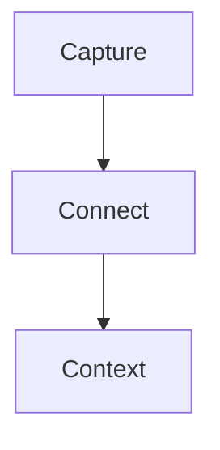

# Logtext Manual

Logtext is a local, Markdown-first workspace for notes and tasks. Markdown files
are canonical. Workspace configuration is stored in a readable JSON file; no
database is required for primary content.

This manual describes the current application. For build instructions and
contribution rules, see [CONTRIBUTING.md](../CONTRIBUTING.md).

## Installation

Release files are published under
[GitHub Releases](https://github.com/elliptical-cow/logtext/releases/latest).
The version in an asset name is written as `<version>` below.

### Windows

Choose one of these files:

- `Logtext-<version>-windows-x86_64-setup.exe`: NSIS installer
- `Logtext-<version>-windows-x86_64-portable.exe`: directly executable build

Run the installer for a normal installation. Use the portable executable when
you do not want an installed copy.

### macOS

Download `Logtext-<version>-macos-universal-app.zip`, extract it, and move
`Logtext.app` to `Applications`. The application bundle supports Intel and Apple
Silicon Macs.

### Debian and Ubuntu

Download `Logtext-<version>-linux-x86_64.deb` and install it through APT:

```bash
sudo apt install ./Logtext-<version>-linux-x86_64.deb
```

APT installs declared system dependencies through the package manager.

### Linux AppImage

The AppImage is the portable Linux fallback:

```bash
chmod +x Logtext-<version>-linux-x86_64.AppImage
./Logtext-<version>-linux-x86_64.AppImage
```

### Thin Linux Archive

`Logtext-<version>-linux-x86_64-thin.tar.gz` contains the native executable
without bundled GTK or WebKitGTK libraries. It is intended for experienced
Linux users and requires a system compatible with the Ubuntu 22.04 build
baseline, including WebKitGTK 4.1, GTK 3, and related runtime libraries.

Extract the archive and check its included `README.txt` for current
prerequisites and limitations.

## First Start

1. Select `File > Open Workspace Folder...`.
2. Choose an existing folder or a new empty folder.
3. Logtext scans all Markdown files below that folder.
4. The editor opens today's journal page.

If `<journalFolder>/YYYY-MM-DD.md` does not exist, Logtext creates it. The
default journal folder is `journal`.

The included [example workspace](example_workspace) demonstrates journals,
backlinks, tasks, favorites, folder colors, and the three-pane layout. Open the
folder itself as a workspace and begin with
[Start Here](example_workspace/Start%20Here.md).

## Workspace Files

A workspace is an ordinary directory. Its important contents are:

```text
workspace/
  .config
  journal/
    2026-09-12.md
  media/
  projects/
    Project Alpha.md
```

- Markdown pages may be organized in arbitrary folders, except inside the
  journal and media folders.
- `.config` contains workspace-specific settings and UI state.
- `journal/` contains dated journal pages by default.
- `media/` contains pasted images by default.

Logtext also stores the last workspace path in `~/.logtext`. On startup it
reopens that workspace if it is still available. The right pane restores its
previous context page.

## Three-Pane Layout

The window has three resizable panes:

- **Left:** file tree, journal navigation, favorites, recent files, task overview,
  and workspace search.
- **Middle:** the active Markdown editor or Task Overview.
- **Right:** an independently navigable rendered page, journal feed, and linked
  references.

The middle and right panes may show different files. This allows editing one
page while keeping another page or a backlink target visible.

Use `View > Reset Column Layout` to restore the default pane sizes.

## Journals

Journal pages provide the default capture workflow.

- Default folder: `journal`
- Required filename format: `YYYY-MM-DD.md`
- Only valid calendar dates directly inside the journal folder count as journal
  pages.
- The journal folder cannot contain subfolders.
- Yesterday, Today, Tomorrow, and Pick controls are available in the left pane.

The configured page sort order determines journal navigation order.

### Right-Pane Journal Feed

When a journal page is opened in the right pane, dated pages are presented as a
continuous rendered feed. Scrolling past the current entry loads adjacent
journal entries in the configured ascending or descending order.

Set `journalRightPaneContinuousScrolling` to `false` to show only the selected
journal page.

### Editor Boundary Navigation

The middle pane edits one file at a time. It does not place multiple Markdown
files in one editor document.

When the editor is at a journal page boundary, an additional mouse-wheel or
Page Up/Page Down action opens the adjacent journal file. No extra click in the
new document is required.

Set `journalEditorContinuousScrolling` to `false` to disable this boundary
navigation.

## Pages and Titles

New pages receive a first-level heading based on the filename:

```md
# Project Alpha
```

The first `# Heading` is the page title used in navigation, tasks, backlinks,
and search results. For an existing file without an H1, Logtext initially uses
the filename without `.md`; opening that file adds a default H1.

## Wiki Links and Tags

Internal links use wiki-link or compact hashtag syntax:

```md
[[Project Alpha]]
[[projects/Project Alpha]]
[[projects/Project Alpha|Alpha]]
#Project-Alpha
#projects/Project-Alpha
```

Rules:

- Targets are matched case-insensitively.
- Actual filesystem spelling is not changed.
- A trailing `.md` in a target is tolerated but normally omitted.
- `[[path/Page|label]]` assigns a display label.
- `#link` supports letters, numbers, `_`, `-`, internal dots, and `/` between
  path segments.
- Compact hashtags cannot contain spaces.
- Selecting a page with spaces from `#` autocomplete replaces the input with a
  `[[target]]` link.
- Markdown headings, task priorities such as `[#A]`, URL fragments, escaped
  hashes, and code are not interpreted as compact links.
- `((...))` is ordinary text and is not an alias for `[[...]]`.

Typing `[[` or a compact `#` target opens page suggestions. Suggestions show
the full workspace-relative page path. If page names are unique, rendered links
may use the shorter page name; ambiguous names retain enough path context to be
distinguishable.

Missing targets are marked in rendered views and can be created explicitly.

When a page or folder is renamed or moved through Logtext, matching wiki links
and related configuration paths are updated.

## Backlinks

A block containing a page link becomes a linked reference on the target page.
Backlinks are calculated from Markdown and are not written into page files.

A linked reference can contain:

- source path and page title
- surrounding heading path
- the linking block
- relevant parent and child blocks

Linked References may appear in the right pane and below the middle editor. The
middle-pane section starts expanded. `Open Tasks only` limits results to
references whose block or child blocks contain an open task.

References are sorted by source path in reverse alphabetical order, then by
their order in the source file. Date-based journal entries therefore normally
appear newest first.

## Editing

The middle pane uses CodeMirror and supports normal Markdown editing plus block
operations.

Common block actions:

- `Enter`: create another list item
- `Tab`: indent the current or selected block
- `Shift+Tab`: outdent the current or selected block
- `Cmd/Ctrl+ArrowUp`: move a block and its children up
- `Cmd/Ctrl+ArrowDown`: move a block and its children down
- `Cmd/Ctrl+1` through `Cmd/Ctrl+4`: collapse blocks below that level
- `Cmd/Ctrl+Shift+E`: expand all blocks

Use `View > Plain markdown edit` or `Cmd/Ctrl+Shift+L` to switch between live
preview and plain Markdown. In live preview, Markdown markers are reduced on
inactive lines and restored when editing requires their source.

### Undo and Redo

Direct editor changes use CodeMirror undo. Task and checkbox changes made in
rendered views use Logtext's application-level undo stack. The Edit menu names
the next application action when available.

- Undo: `Cmd/Ctrl+Z`
- Redo: `Cmd/Ctrl+Shift+Z` or `Cmd/Ctrl+Y`

## Tasks

Tasks are Markdown list items beginning with a configured state:

```md
- TODO Prepare project review
- INPROGRESS [#A] Write decision note
- WAITING[#B] Feedback from stakeholder
- DONE Close release checklist
```

Default states:

- `TODO`
- `INPROGRESS`
- `WAITING`
- `DONE`

Use `Cmd/Ctrl+Enter` in the editor to add or cycle a task state. A right click
on a rendered task keyword opens a compact menu for Status, Priority, and
showing the source line in the other pane.

Changing a task to the final configured state may play a completion sound. Set
`taskDoneSoundEnabled` to `false` to disable it.

### Priorities

Supported priority cookies are `[#A]`, `[#B]`, and `[#C]`:

```md
- TODO [#A] High priority
- TODO[#B] Compact task-state syntax
```

The space between task state and priority is optional.

### Task Overview

Open Task Overview from the left pane or with
`View > Show Task Overview` (`Cmd/Ctrl+Shift+T`). It supports:

- status, priority, and text filters
- grouping by status, priority, source, folder, or linked page
- inherited linked-page context from parent blocks

Clicking a task opens its source page in the right pane. `Edit` opens the source
in the middle pane and selects its line.

## Checkboxes

Standard Markdown checkboxes are rendered and clickable in the middle and right
panes:

```md
- [ ] Open item
- [x] Completed item
```

Clicking a rendered checkbox updates the source Markdown file.

## Images and Media

Paste a PNG, JPEG, WebP, or GIF image of up to 20 MiB from the clipboard into an
open page. Logtext stores it in the configured media folder and inserts a
workspace-relative Markdown reference at the current selection:

```md

```

The generated filename contains:

- a normalized form of the source page path
- a timestamp
- a short content fingerprint

Image targets are resolved relative to the workspace root, not the Markdown
file. The reference therefore remains valid when copied to another page or when
the source page moves.

Unsupported image paths include:

- a leading `/`
- operating-system absolute paths
- `..` path segments

Images are rendered in editor live preview, the right pane, journal feeds,
backlinks, and Task Overview.

### Resize an Image

Hover over an image in editor live preview. The `-` and `+` controls in its
upper-left corner change the width in 20–25 percent steps. The width is stored
in the optional Markdown image title; an existing title is preserved.

The aspect ratio is fixed. Images wider than the pane remain constrained to the
available pane width.

### Copy an Image

Right-click a workspace image and select `Copy image` to place the image itself
on the operating-system clipboard. The action is available in editor live
preview and rendered views. It does not apply to external image paths.

### Clean Media

Removing a Markdown image reference does not automatically delete the file.
Use `File > Clean Media...` to scan for supported image files that are no longer
referenced.

Logtext shows the candidates in a scrollable confirmation dialog. `Move to
Trash` sends confirmed files to the operating-system trash; `Cancel` makes no
changes.

## LaTeX

KaTeX renders inline and block formulas:

```md
Energy is $E = mc^2$.

$$
\int_0^1 x^2 \, dx
$$
```

Invalid formulas remain visible as source text without preventing the rest of
the page from rendering.

In editor live preview, formulas are rendered on inactive lines. Selecting an
inline formula restores its source line. Selecting any line in a block formula
restores the complete `$$...$$` block for editing.

## Mermaid

The right pane renders fenced `mermaid` code blocks:

````md

````

This applies to pages, the continuous journal feed, and linked references.
Diagrams are rendered when they approach the visible area. Theme changes
rerender visible diagrams with matching colors.

Current limitations:

- Mermaid source remains a fenced code block in the middle editor.
- Invalid Mermaid syntax remains visible with a local error message.

## Navigation and File Operations

The left pane contains a compact file tree. Files are sorted by descending name
by default. Each folder may override that order.

Actions include:

- open a page in the editor
- open a page in the right pane
- add or remove a favorite
- create, rename, move, and delete pages and folders
- move pages with drag and drop
- assign a folder color
- choose ascending, descending, or modified-time sorting and reorder items
  manually

File and folder context menus contain secondary actions. Normal left-click
behavior is not repeated unnecessarily.

Folder colors apply to the folder icon and to links targeting pages below that
folder. The default link chip remains light blue with dark blue text.

Logtext updates matching wiki links when pages or folders move. Workspace-rooted
image references do not need rewriting.

## Search

### Current File

Press `Cmd/Ctrl+F` in the editor to search the current Markdown file. Expand the
search panel to show replacement controls. Replacements are normal editor
changes and participate in dirty-state handling, Save, and undo.

### Workspace

Use the search field in the left pane to search indexed Markdown files. Results
include file, line, and context and may be opened in the editor.

## Context Menus

Context menus depend on the clicked content.

Editor examples:

- text operations: Cut, Copy, Paste, Select All
- selection formatting, including linking the selection as a page
- wiki links: follow the link in another pane, copy the wikilink, or show its
  source line in the right pane
- task keywords: Status, Priority, Show line in right pane
- blocks: block-specific formatting and navigation

Right-pane examples:

- Copy selected text
- wiki links: follow the link in the editor or show its source line there
- task keywords: Status, Priority, Show line in editor
- Copy image for workspace images

Where an exact keyboard equivalent exists, the menu shows a subtle Windows-style
hint such as `Ctrl+C` or `Shift+Tab`.

## Keyboard Shortcuts

Open `Help > Keyboard Shortcuts` for the list shipped with the running version.

| Action | Shortcut |
| --- | --- |
| New file | `Cmd/Ctrl+N` |
| Open workspace | `Cmd/Ctrl+O` |
| Close workspace | `Cmd/Ctrl+Shift+W` |
| Save | `Cmd/Ctrl+S` |
| Undo | `Cmd/Ctrl+Z` |
| Redo | `Cmd/Ctrl+Shift+Z` or `Cmd/Ctrl+Y` |
| Search current file | `Cmd/Ctrl+F` |
| Add or cycle task state | `Cmd/Ctrl+Enter` |
| Toggle Task Overview | `Cmd/Ctrl+Shift+T` |
| Toggle editor mode | `Cmd/Ctrl+Shift+L` |
| Expand all blocks | `Cmd/Ctrl+Shift+E` |
| Collapse below levels 1–4 | `Cmd/Ctrl+1` through `Cmd/Ctrl+4` |
| Move block up/down | `Cmd/Ctrl+ArrowUp` / `Cmd/Ctrl+ArrowDown` |
| Indent/outdent | `Tab` / `Shift+Tab` |
| Open editor context menu | `Shift+F10` or `Menu` |
| Zoom in/out/reset | `Cmd/Ctrl+=` / `Cmd/Ctrl+-` / `Cmd/Ctrl+0` |

`Cmd/Ctrl + mouse wheel` also changes UI zoom.

## Configuration

Workspace settings are stored as JSON in `.config` at the workspace root.
Logtext creates the file when a workspace is first opened and updates UI state
there as it changes.

A representative configuration:

```json
{
  "journalFolder": "journal",
  "mediaFolder": "media",
  "journalEditorContinuousScrolling": true,
  "journalRightPaneContinuousScrolling": true,
  "taskStates": ["TODO", "INPROGRESS", "WAITING", "DONE"],
  "taskStateColors": {
    "TODO": "red",
    "INPROGRESS": "blue",
    "WAITING": "orange",
    "DONE": "green"
  },
  "taskDoneSoundEnabled": true,
  "defaultPageSort": "name-desc",
  "folderPageSort": {
    "journal": "name-desc"
  },
  "folderColors": {
    "projects": "blue"
  },
  "themeMode": "light"
}
```

### User-Facing Settings

| Field | Values and behavior |
| --- | --- |
| `journalFolder` | Workspace-relative folder; defaults to `journal`. No `.`, `..`, or empty segments. |
| `mediaFolder` | Workspace-relative folder; defaults to `media`. Cannot overlap the journal folder or use `.git`, `node_modules`, or `target`. |
| `journalEditorContinuousScrolling` | Boolean; enables journal boundary navigation in the editor. |
| `journalRightPaneContinuousScrolling` | Boolean; enables the continuous right-pane journal feed. |
| `taskStates` | Ordered list of uppercase states using letters, numbers, or `_`. The final state is treated as complete. |
| `taskStateColors` | State-to-color map. Supported colors: `red`, `yellow`, `green`, `blue`, `grey`, `orange`, `pink`. |
| `taskDoneSoundEnabled` | Boolean; controls the completion sound. |
| `defaultPageSort` | `name-desc`, `name-asc`, `modified-desc`, or `modified-asc`. |
| `folderPageSort` | Folder-path-to-sort-mode map. |
| `folderColors` | Folder-path-to-color map using the task color names. |
| `themeMode` | `light` or `dark`. |

The journal and media folders must not be the same folder, ancestors, or
descendants of each other.

### Application-Managed State

Logtext may also write these fields:

- `manualPageOrder`
- `expandedFolders`
- `pageFavorites`
- `recentPages`
- `navigationLayout`
- `taskOverview`
- `backlinkView`
- `lastEditorPath`
- `lastRightPanePath`

They remain readable JSON, but normally should be changed through the UI.
Unknown or invalid values may be normalized when the workspace is loaded.

## Data Safety

- Markdown files are the source of truth.
- Backlinks and search data are derived from Markdown.
- `.config` contains settings and UI state, not note content.
- Keep normal filesystem backups or version-control history for important
  workspaces.
- Use Logtext's move and rename actions when wiki links should be updated.
- Review the candidate list before confirming `Clean Media`.

Logtext is provided without warranty and is still in early development. See the
[security policy](../SECURITY.md) for reporting security issues.

## Current Limitations

- The editor switches between individual journal files; only the right pane
  provides a multi-file journal feed.
- Mermaid diagrams render only in the right pane.
- Workspace image references cannot point to absolute or parent-directory
  paths.
- The thin Linux archive does not install desktop integration or system
  dependencies.

For implementation details and recorded design decisions, see
[Developer Notes](dev-notes.md).
